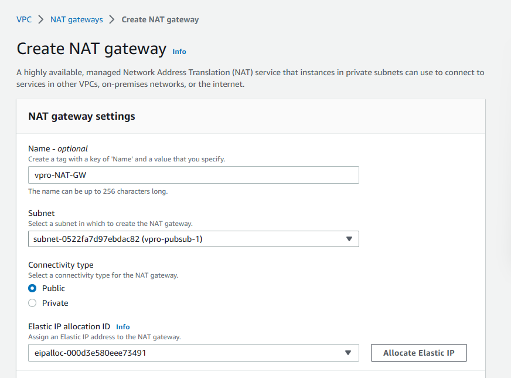

# Project-9: Ansible for AWS VPC

[*Project Source*](https://www.udemy.com/course/decodingdevops/learn/lecture/26466332#overview)

## Pre-Requisites:

* AWS Account
* IDE ( VSCode) 


## Step-1: VPC  Setup for AWS

- Create a vpc  with the details below:
```sh
vprofile-VPC
VPC Range: 172.20.0.0/16
Tenancy: Default
```


- Create four `vpc subnet` with the details below:
```sh
VPC ID: Vprofile VPC
Subnet name: vpro-pubsub-1
Availabilty zone:us-west-1a
VPC Range: 172.20.1.0/24

VPC ID: Vprofile VPC
Subnet name: vpro-pubsub-2
Availabilty zone:us-west-1b
VPC Range: 172.20.2.0/24

VPC ID: Vprofile VPC
Subnet name: vpro-privsub-1
Availabilty zone:us-west-1a
VPC Range: 172.20.3.0/24

VPC ID: Vprofile VPC
Subnet name: vpro-privsub-2
Availabilty zone:us-west-1b
VPC Range: 172.20.4.0/24
```


- Create `Internet gateways` with the details below and attach it to the VPC
```sh
Name tag: vpro-RT
```


- Create `Route Table` with the details below and attach it to the public subnets
```sh
Name tag: vpro-pub-RT
VPC: Vprofile-VPC
```


- Navigate to the Route under Route Table and edit it to allow all IPV4 traffic pass through Internet gateway as that makes it a public subnet
```sh
0.0.0.0/0
Target: Internet gateway
```


- Create Nat gateway for the private subnets
```sh
Name tag: vpro-NAT-GW
Allocate elastic ip
```



- Create Route Table with the details below and attach it to the private subnets

```sh
Name tag: vpro-priv-RT
VPC: Vprofile-VPC
```


- Navigate to the Route under Route Table and edit it to allow all IPV4 traffic pass through NAT gateway as that makes it a private subnet
```sh
0.0.0.0/0
Target: Internet gateway
```


## Step-2: Assign IP Settings

- For Public subnet: 
  Navigate to edit subnet settings and enable auto-assign IP setting on both subnets so any instance launched in the public subnet can get an automatic public IP.


- Go to VPC setting, edit DNS host name and enable


## Step-3: Create EC2 instances
- Create an EC2 Instance with the details below:
```sh
Name: web01
AMI: centos7 
Instance Type: t2.micro
VPC: vprofile-VPC
Subnet: vpro-privsub-1
SecGrp name: web-sg
SecGrp: allow SSH on port 22 from my ip
key pair: wave-key
```

- userdata
```sh
#!/bin/bash

# Variable Declaration
PACKAGE="httpd wget unzip"
SVC="httpd"
URL='https://www.tooplate.com/zip-templates/2098_health.zip'
ART_NAME='2098_health'
TEMPDIR="/tmp/webfiles"

# Installing Dependencies
echo "########################################"
echo "Installing packages."
echo "########################################"
sudo yum install $PACKAGE -y > /dev/null
echo

# Start & Enable Service
echo "########################################"
echo "Start & Enable HTTPD Service"
echo "########################################"
sudo systemctl start $SVC
sudo systemctl enable $SVC
echo

# Creating Temp Directory
echo "########################################"
echo "Starting Artifact Deployment"
echo "########################################"
mkdir -p $TEMPDIR
cd $TEMPDIR
echo

wget $URL > /dev/null
unzip $ART_NAME.zip > /dev/null
sudo cp -r $ART_NAME/* /var/www/html/
echo

# Bounce Service
echo "########################################"
echo "Restarting HTTPD service"
echo "########################################"
systemctl restart $SVC
echo

# Clean Up
echo "########################################"
echo "Removing Temporary Files"
echo "########################################"
rm -rf $TEMPDIR
echo

sudo systemctl status $SVC
ls /var/www/html/
```

## Step-4: Launch the Bastion host

- Launch Bastion host with the details below to enable us SSH into the instance created as it has no public IP due to its settings.

```sh
Name: Bation/jumpServer
AMI: Amazon Linux
Instance Type: t2.micro
VPC: vprofile-VPC
Subnet: vpro-pubsub-1
SecGrp name: bastion-sg
SecGrp: allow SSH on port 22 from my ip
key pair: bastion-key
```

- Log into Bastion host and SSH into web01. 
- First, upgrade web01 SG to allow SSH from Bastion private IP

```sh
SecGrp: allow SSH on port 22 from my ip
```


- Log into  the bastion server by copying the web server key to enable us SSH
```sh
scp -i Downloads/bastion-key.pem Downloads/wave-key.pem ec2-user@<bastion public IP:/home/ec2-user/
ssh -i Downloads/bastion-key.pem ec2-user@<bastion public ip>
```


- Give 400 permission to the webserver key then SSH afterwards
```sh
ls
ls -l
chmod 400 wave-key.pem
ssh -i wave-key.pem centos@<webserver privateIP>
sudo yum install httpd -y
systemctl start httpd
systemctl enable httpd
systemctl status httpd
```


## Step-5: Create a Load Balancer

- Create a classic load balancer with the below details:
```sh
Name: wave-elb
Instance: web01
VPC: vprofile-VPC
Subnet: vpro-pubsub-1
      : vpro-pubsub-2
SecGrp name: wave-elb-sg
SecGrp: allow SSH on port 22 from anywhere
```

- Web server security group should allow connection from the load balancer.
```sh
SecGrp: allow SSH on port 80 from wave-elb-sg
```


- Access the webservice from the load balancer via the DNS name
```sh
wave-elb-2006507400.us-west-1.elb.amazonaws.com
```


## Step-6: VPC peering

- Connecting two VPC's together, this can be done across regions.
- Switch to another region and create a new VPC with the details below

```sh
Region: Oregon
Name tag: DR-vprofile
VPC Range: 172.16.0.0/16
Tenancy: Default
```

- Navigate to peering connections and peer both VPC's (North California and Oregon)

```sh
Select a local VPC to peer with
VPC ID (Requester): vprofile-VPC

Select another VPC to peer with

Another Region: us-west-2 Oregon
VPC ID (Accepter)
```

- Go to VPC (Accepter) Oregon and accept request from VPC (Requester) N.California


- Update the `Route Table` of both side subnets
- From `Route Table`  `VPC North California`, edit both private and public subnet to route all traffic from `VPC Oregon` to peering connection and vice versa
```sh
Select a local VPC to peer with
VPC ID (Requester): vprofile-VPC
```


## Step-7: Network ACL
- As security group is for the instance, network ACL is for the subnet.
- Create a new NACL with the details below and associate public subnets to it.

```sh
Region: N.California
Name tag: pub-sub-NACL
VPC: vprofile VPC
Tenancy: Default
```

- Edit Inbound and Outbound rules
```sh
Allow all traffic on rule number 100
Deny all traffic on rule number 200
```

## Step-8: Clean up